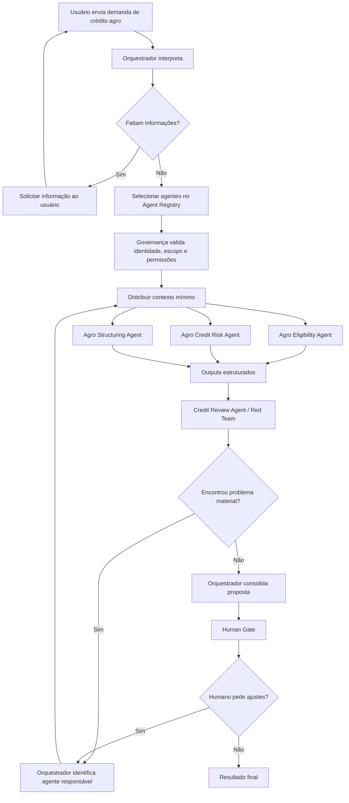

# Hackathon Itaú 2026 — Itaú-Native Agent Squads
## MVP: Orquestração multiagente para Crédito Agro

> **Status:** especificação funcional e técnica para implementação do MVP no hackathon.  
> **Objetivo deste README:** permitir que um agente de desenvolvimento (ex.: Devin) entenda o problema, a arquitetura, o comportamento esperado, os limites do MVP, os requisitos de governança e a experiência de demonstração sem depender de contexto externo.

---

# 1. Resumo executivo

A proposta é criar uma camada de **orquestração de agentes especializados no “jeito Itaú” de trabalhar**.

Em vez de construir um único agente generalista que recebe todo o contexto do banco e tenta resolver qualquer problema, o sistema recebe uma demanda, interpreta o objetivo e monta uma **squad temporária** de agentes especializados. Cada agente recebe apenas o contexto, as ferramentas e os dados necessários para cumprir sua subtarefa.

O MVP será demonstrado em um caso específico:

> **Análise e estruturação de crédito para um cliente do agronegócio.**

A escolha do crédito agro é deliberada: é um processo que pode envolver documentação específica, enquadramento, informações financeiras, risco agrícola, características de safra, garantias, condicionantes e revisão. Isso cria um exemplo suficientemente rico para mostrar o valor de uma arquitetura multiagente.

O MVP deve demonstrar cinco ideias centrais:

1. **Orquestração dinâmica:** o sistema decide quais especialistas devem participar.
2. **Agentes Itaú-native:** cada especialista segue um playbook, linguagem, regras, fontes e ferramentas próprias.
3. **Governança por design:** cada agente herda as permissões do usuário e só acessa o mínimo necessário.
4. **Qualidade e revisão:** uma etapa crítica tenta encontrar inconsistências antes de apresentar a proposta.
5. **Decisão humana:** a IA prepara, analisa e recomenda; decisões materiais continuam com o analista/gerente.

O produto **não é “quatro chatbots conversando”**. O produto é uma camada de coordenação entre especialistas, dados governados, políticas, ferramentas e humanos.

---

# 2. Contexto do hackathon

O projeto será entregue no **Hackathon Itaú 2026**, na trilha de **Jornada de Agentes**.

A pergunta que queremos responder é, em essência:

> Como uma squad orientada por IA pode transformar uma demanda em valor de forma mais rápida, mantendo qualidade, governança e decisão humana onde ela realmente importa?

A resposta proposta é:

> **Criar um “sistema operacional de squads de agentes” do Itaú:** o orquestrador monta equipes temporárias de agentes especialistas, cada uma com acesso governado às informações, playbooks do banco, regras explícitas e checkpoints humanos.

---

# 3. Entregáveis do hackathon

Conforme as orientações apresentadas pela organização, devem existir **quatro entregas coerentes entre si**:

1. **Protótipo**
2. **Slides**
3. **Vídeo**
4. **Ficha / submissão**

Requisitos operacionais observados:

- todos os quatro materiais devem apresentar **a mesma versão do projeto**;
- os limites/requisitos de cada entrega devem ser respeitados;
- equipe e case devem estar claramente identificados;
- os links precisam abrir sem login;
- Canva, quando usado, deve estar com acesso liberado;
- vídeo deve estar público/acessível conforme solicitado;
- quaisquer dados utilizados no protótipo devem ser **fictícios ou explicitamente simulados**;
- o recebimento/envio final deve ser confirmado.

## Checklist de entrega

- [ ] Protótipo público e acessível sem login
- [ ] Slides na versão final
- [ ] Vídeo correspondente à mesma versão do protótipo
- [ ] Ficha correspondente à mesma versão
- [ ] Nome da equipe presente
- [ ] Case/trilha identificados
- [ ] Dados mock claramente identificados
- [ ] Simulações identificadas
- [ ] Links testados em aba anônima
- [ ] Recebimento/submissão confirmado

---

# 4. Problema que o MVP resolve

## 4.1 Problema amplo

Em uma instituição grande, o conhecimento necessário para resolver um problema de negócio está distribuído entre:

- diferentes áreas;
- especialistas humanos;
- políticas;
- bases de dados;
- sistemas;
- manuais;
- históricos de operações;
- práticas internas;
- regras de governança.

Um funcionário pode saber **o que quer resolver**, mas não necessariamente:

- quais informações precisa buscar;
- quais especialistas deveria consultar;
- quais políticas se aplicam;
- quais sistemas deve utilizar;
- quais alternativas deveria considerar;
- quais riscos precisam ser revisados.

A proposta é fazer o sistema montar automaticamente a “reunião certa”.

## 4.2 Problema específico do MVP

No MVP, o usuário será um analista/gerente lidando com uma demanda de **crédito agro**.

Exemplo:

> “O cliente Fazenda Horizonte solicita R$ 50 milhões para financiar o custeio da próxima safra de soja. Analise a operação e estruture alternativas.”

O sistema deve:

- verificar se há informações suficientes;
- identificar pendências;
- analisar capacidade de pagamento e riscos;
- propor uma estrutura;
- revisar criticamente a proposta;
- apresentar evidências e pendências;
- solicitar decisão/revisão humana no final.

---

# 5. Visão do produto

## 5.1 Conceito

**Itaú-Native Agent Squads** é uma camada de orquestração que transforma uma demanda de negócio em uma squad temporária de agentes especializados.

Fluxo conceitual:

```text
Demanda
  ↓
Orquestrador
  ↓
Entende o objetivo e o risco
  ↓
Seleciona agentes apropriados
  ↓
Aplica permissões e contexto mínimo
  ↓
Agentes executam tarefas
  ↓
Red Team / Review
  ↓
Consolidação
  ↓
Human Gate
  ↓
Decisão / próxima etapa
```

## 5.2 Princípio fundamental

O orquestrador **não precisa saber fazer tudo**.

Ele precisa saber:

- decompor o problema;
- descobrir quais capacidades são necessárias;
- selecionar os agentes corretos;
- distribuir contexto;
- observar resultados;
- replanejar;
- consolidar;
- escalar para humanos.

---

# 6. Escopo do MVP

O MVP deve provar a arquitetura, não reproduzir todos os sistemas reais do banco.

## Dentro do escopo

- interface de chat/tarefa;
- orquestrador;
- quatro agentes especializados;
- camada de dados simulada;
- camada de governança simulada;
- controle de permissões mock;
- RAG ou base de conhecimento simplificada;
- outputs estruturados;
- revisão crítica;
- loop de reexecução;
- human gate;
- rastreabilidade de fontes;
- painel visual da execução da squad;
- cenário de crédito agro com dados fictícios.

## Fora do escopo

- integração com sistemas reais do Itaú;
- aprovação real de crédito;
- envio de proposta a cliente real;
- execução financeira;
- dados confidenciais;
- decisões automáticas vinculantes;
- treinamento de modelo base do zero;
- reprodução completa de políticas internas reais;
- cálculo oficial de limite;
- modelos proprietários reais de risco;
- acesso a documentos internos não fornecidos.

---

# 7. Arquitetura funcional

## 7.1 Componentes

A arquitetura possui cinco blocos principais:

```text
┌───────────────────────────────────────────┐
│           ORCHESTRATION LAYER             │
│  entender → planejar → delegar → iterar   │
├───────────────────────────────────────────┤
│              AGENT LAYER                  │
│ Eligibility | Risk | Structuring | Review │
├───────────────────────────────────────────┤
│          DATA / KNOWLEDGE LAYER           │
│ mock DB | policies | docs | source IDs    │
├───────────────────────────────────────────┤
│            GOVERNANCE LAYER               │
│ IAM | permission check | audit | policies │
├───────────────────────────────────────────┤
│              HUMAN LAYER                  │
│ review | approve | override | decide      │
└───────────────────────────────────────────┘

Transversal:
QUALITY + EVALS + OBSERVABILITY + LOGGING
```

---

# 8. Workflow completo do MVP



---

# 9. O Agente Orquestrador

O Orquestrador é o núcleo da solução.

Ele substitui a ideia de existir um “agente geral” separado. Não deve haver redundância entre um agente geral e um orquestrador.

## Responsabilidades

1. receber a demanda;
2. classificar o tipo de problema;
3. identificar objetivo;
4. verificar se faltam informações;
5. decompor a tarefa;
6. selecionar agentes;
7. determinar dependências;
8. solicitar dados/contextos;
9. delegar subtarefas;
10. controlar execução;
11. detectar falhas;
12. replanejar;
13. consolidar outputs;
14. escalar para humano.

## O Orquestrador NÃO deve

- consultar todas as bases diretamente por padrão;
- executar todos os cálculos;
- substituir os agentes especialistas;
- aprovar crédito;
- ignorar policy engine;
- inferir permissões;
- inventar fontes;
- passar todo o histórico para todos os agentes.

## Output esperado

```json
{
  "case_id": "CASE-AGRO-001",
  "intent": "credito_agro",
  "objective": "avaliar e estruturar custeio de safra",
  "missing_information": [],
  "selected_agents": [
    "agro_eligibility",
    "agro_credit_risk",
    "agro_structuring",
    "credit_review"
  ],
  "execution_plan": [
    {
      "agent": "agro_eligibility",
      "task": "validar documentos e enquadramento"
    },
    {
      "agent": "agro_credit_risk",
      "task": "analisar capacidade de pagamento e risco agro"
    },
    {
      "agent": "agro_structuring",
      "task": "propor alternativas de estrutura"
    }
  ]
}
```

---

# 10. Agentes especializados do MVP

Serão usados **no máximo quatro agentes especialistas**.

---

## 10.1 Agro Eligibility Agent

### Pergunta que responde

> “Essa operação está suficientemente completa e enquadrável para seguir?”

### Responsabilidades

- verificar documentação;
- verificar consistência de dados;
- identificar campos obrigatórios ausentes;
- validar requisitos do produto;
- verificar enquadramento simplificado;
- gerar lista de pendências;
- identificar flags;
- produzir status de prontidão.

### Input

```json
{
  "case_id": "CASE-AGRO-001",
  "client_id": "CLIENTE-001",
  "requested_amount": 50000000,
  "purpose": "custeio de soja",
  "available_documents": [],
  "available_data": {}
}
```

### Output

```json
{
  "status": "ready_with_warnings",
  "is_eligible": true,
  "missing_items": [],
  "warnings": [
    {
      "code": "DOC_AREA_MISMATCH",
      "message": "Área declarada difere entre duas fontes mock."
    }
  ],
  "evidence_ids": [
    "SRC_CLIENT_PROFILE",
    "SRC_AGRO_REGISTRY"
  ],
  "human_attention_required": false
}
```

### Knowledge/Playbook

- checklist de documentação;
- regras de enquadramento simuladas;
- glossário;
- regras do produto;
- exemplos históricos fictícios;
- política mock.

---

## 10.2 Agro Credit Risk Agent

### Pergunta que responde

> “O cliente consegue pagar? Quais são os principais riscos?”

### Responsabilidades

- analisar situação financeira;
- calcular métricas;
- avaliar capacidade de pagamento;
- considerar dívida atual;
- considerar exposição;
- analisar cultura e ciclo;
- analisar produtividade;
- considerar preço da commodity;
- considerar concentração geográfica;
- realizar cenários de estresse;
- identificar riscos e mitigantes.

### Exemplos de variáveis mock

- receita;
- EBITDA;
- dívida;
- caixa;
- produção esperada;
- área plantada;
- produtividade esperada;
- produtividade histórica;
- preço de soja;
- custo da safra;
- exposição ao banco;
- concentração de safra;
- indicadores climáticos fictícios.

### Importante

Cálculos determinísticos devem ser feitos por **código/ferramentas**, não apenas pelo LLM.

### Output

```json
{
  "risk_summary": "moderate",
  "repayment_capacity": "adequate_with_conditions",
  "metrics": {
    "net_debt_ebitda": 2.8,
    "expected_cash_generation": 82000000,
    "requested_amount": 50000000
  },
  "stress_scenarios": [
    {
      "scenario": "commodity_price_minus_15pct",
      "result": "still_payable_with_reduced_buffer"
    },
    {
      "scenario": "productivity_minus_10pct",
      "result": "attention_required"
    }
  ],
  "main_risks": [
    "concentracao_em_soja",
    "sensibilidade_a_produtividade"
  ],
  "mitigants": [
    "historico_produtivo_estavel",
    "garantia_mock_disponivel"
  ],
  "evidence_ids": [
    "SRC_FINANCIALS",
    "SRC_PRODUCTION_HISTORY",
    "SRC_MARKET_DATA"
  ]
}
```

---

## 10.3 Agro Structuring Agent

### Pergunta que responde

> “Como podemos estruturar essa operação?”

### Responsabilidades

- utilizar necessidade do cliente;
- utilizar avaliação de risco;
- considerar restrições identificadas;
- comparar alternativas;
- sugerir prazo;
- sugerir amortização;
- sugerir garantias;
- sugerir condicionantes;
- explicar racional;
- evidenciar trade-offs.

### Importante

As alternativas do MVP são **simuladas**.

Não devem ser apresentadas como proposta real do banco.

### Output

```json
{
  "alternatives": [
    {
      "id": "ALT-A",
      "name": "Estrutura A",
      "product": "credito_rural_custeio_mock",
      "amount": 50000000,
      "tenor_months": 12,
      "amortization": "bullet_after_harvest",
      "guarantees": [
        "garantia_mock_A"
      ],
      "conditions": [
        "condicao_mock_1"
      ],
      "rationale": "Alinha pagamento ao ciclo de geração de caixa da safra.",
      "risks": [
        "sensibilidade_produtividade"
      ]
    },
    {
      "id": "ALT-B",
      "name": "Estrutura B",
      "product": "estrutura_agro_alternativa_mock",
      "amount": 50000000,
      "tenor_months": 18,
      "amortization": "custom",
      "guarantees": [
        "garantia_mock_B"
      ],
      "conditions": [],
      "rationale": "Maior flexibilidade de prazo, com trade-off de custo.",
      "risks": [
        "custo_maior"
      ]
    }
  ],
  "preferred_for_discussion": "ALT-A",
  "evidence_ids": [
    "SRC_PRODUCT_CATALOG",
    "SRC_RISK_OUTPUT"
  ]
}
```

O campo `preferred_for_discussion` é apenas uma priorização operacional para o humano avaliar. O sistema não aprova a operação.

---

## 10.4 Credit Review Agent / Red Team

### Pergunta que responde

> “O que pode estar errado, inconsistente ou faltando?”

### Responsabilidades

- conferir coerência;
- verificar grounding;
- encontrar contradições;
- identificar premissas fracas;
- verificar campos ausentes;
- desafiar a análise de risco;
- verificar se a estrutura ignora restrições;
- verificar se uma conclusão ultrapassa a evidência;
- identificar necessidade de reexecução.

### Output

```json
{
  "review_status": "needs_rework",
  "issues": [
    {
      "severity": "high",
      "owner_agent": "agro_credit_risk",
      "code": "PRODUCTIVITY_ASSUMPTION",
      "message": "Produtividade usada está acima do histórico sem justificativa.",
      "required_action": "recalculate_with_historical_baseline"
    }
  ],
  "grounding_ok": true,
  "policy_ok": true,
  "reexecution_required": true
}
```

Se houver `reexecution_required=true`, o Orquestrador deve:

1. identificar o agente responsável;
2. criar nova subtarefa;
3. passar somente o contexto necessário;
4. receber output corrigido;
5. reenviar ao Review Agent.

---

# 11. O “Agente de Busca” NÃO é um dos quatro especialistas

A busca deve ser tratada como uma **capacidade/ferramenta da plataforma**, e não como um especialista de negócio.

Arquitetura:

```text
Eligibility Agent ──┐
Risk Agent ─────────┼──> Data / Search Layer
Structuring Agent ──┘
                         ↓
                    Permission Check
                         ↓
                    Fonte autorizada
                         ↓
                  Resultado + source_id
```

## Por quê?

Criar um LLM separado apenas para buscar dados tende a:

- aumentar latência;
- aumentar tokens;
- criar chamadas adicionais;
- criar mais pontos de falha;
- adicionar risco de alucinação;
- complicar governança.

A busca simples deve funcionar como ferramenta/API.

Exemplos:

```python
get_client_financials(client_id)
get_agro_profile(client_id)
get_market_data(commodity)
get_product_catalog()
search_policy(query)
get_historical_cases(filters)
```

## Exceção

Uma pesquisa complexa pode exigir raciocínio, por exemplo:

> “Encontre precedentes realmente comparáveis considerando cultura, região, porte, risco e estrutura.”

Nesse caso, futuramente pode existir um `ResearchAgent`, mas **não faz parte dos quatro agentes centrais do MVP**.

---

# 12. Itaú-native agents

Um agente Itaú-native não é apenas um prompt do tipo “você é especialista em crédito”.

Conceitualmente:

```text
Itaú-native Agent =
Especialidade
+ Playbook
+ Conhecimento institucional
+ Ferramentas
+ Regras
+ Permissões
+ Evals
+ Human Gates
```

Cada agente deve ter um `Agent Card`.

---

# 13. Agent Registry

O Orquestrador não inventa agentes. Ele consulta um registry.

Exemplo:

```json
{
  "agent_id": "agro_credit_risk",
  "name": "Agro Credit Risk Agent",
  "version": "0.1.0",
  "owner": "MVP Hackathon",
  "status": "active",
  "capabilities": [
    "credit_risk_analysis",
    "agro_risk_analysis",
    "stress_testing"
  ],
  "tools": [
    "get_client_financials",
    "get_agro_profile",
    "calculate_credit_metrics",
    "run_stress_test"
  ],
  "allowed_data_domains": [
    "client_financials",
    "agro_profile",
    "market_mock"
  ],
  "forbidden_actions": [
    "approve_credit",
    "send_client_proposal"
  ],
  "human_gate_required_for": [
    "material_decision",
    "external_action"
  ]
}
```

---

# 14. Governança

Governança não deve ser um prompt.

A camada de governança deve ser separada do LLM.

## Regra principal

```text
Acesso efetivo
=
Permissão do usuário
∩
Permissão do agente
∩
Necessidade da tarefa
```

## Exemplo

Usuário possui acesso a:

- dados financeiros do cliente;
- operações de crédito;
- determinadas fontes agro.

O Risk Agent precisa somente de:

- dados financeiros;
- perfil agro;
- dados de mercado.

Ele não deve receber todo o universo acessível ao usuário.

---

# 15. Identity propagation

Toda execução deve carregar:

```json
{
  "user_id": "USER-DEMO-001",
  "case_id": "CASE-AGRO-001",
  "task_id": "TASK-123",
  "purpose": "credito_agro_analysis",
  "permissions": [
    "client_financials:read",
    "agro_profile:read",
    "credit_products:read"
  ]
}
```

Todo tool call deve saber:

- quem pediu;
- em nome de quem está sendo executado;
- para qual caso;
- para qual finalidade.

---

# 16. No privilege union

Regra crítica:

> Combinar agentes diferentes nunca pode somar permissões e criar um superusuário.

Se:

```text
Usuário pode A e B
Agente 1 pode A e C
Agente 2 pode B e D
```

o sistema NÃO pode concluir:

```text
Squad pode A + B + C + D
```

Cada tool call é autorizado individualmente.

---

# 17. Purpose limitation

Mesmo se o usuário puder acessar um dado, um agente só deve acessá-lo se:

1. estiver dentro da tarefa;
2. for necessário;
3. estiver permitido ao agente;
4. estiver permitido ao usuário.

---

# 18. Human-in-the-loop

O humano não deve revisar tudo.

A autonomia varia conforme o risco.

| Tipo de atividade | Exemplo | Comportamento |
|---|---|---|
| Informação | buscar dado | automático |
| Preparação | calcular métrica | automático |
| Análise | comparar cenários | automático |
| Recomendação | sugerir estrutura | IA propõe |
| Decisão material | aprovar limite | humano obrigatório |
| Ação externa | enviar proposta | humano obrigatório |

## Human Gate no MVP

Antes da finalização, mostrar:

```text
STATUS: PRONTO PARA REVISÃO HUMANA

Estrutura sugerida:
...

Riscos:
...

Pendências:
...

Fontes:
...

Review status:
Passed

[Solicitar ajuste] [Aprovar para próxima etapa]
```

O botão “Aprovar para próxima etapa” **não aprova crédito real**. No MVP, significa apenas concluir o fluxo de demonstração.

---

# 19. Quality Plane

Qualidade deve existir antes, durante e depois.

## 19.1 Antes

- Agent Registry;
- versões;
- evals;
- golden cases;
- tool permissions.

## 19.2 Durante

- schemas;
- tool calls;
- grounding;
- policy checks;
- cálculo determinístico;
- source IDs;
- validation.

## 19.3 Depois

- Review Agent;
- human gate;
- audit log;
- feedback.

---

# 20. Schemas e outputs estruturados

Agentes não devem trocar textos enormes entre si.

Preferir JSON compacto.

Motivos:

- menor consumo de tokens;
- melhor validação;
- menos ambiguidade;
- mais fácil auditoria;
- mais fácil UI;
- mais fácil testabilidade.

---

# 21. Economia de tokens

Multiagentes **não economizam tokens automaticamente**.

Um sistema mal desenhado pode custar mais que um agente único.

A economia vem de:

1. roteamento;
2. contexto mínimo;
3. RAG;
4. outputs compactos;
5. tool calls;
6. modelos diferentes por tarefa;
7. não reenviar documentos inteiros.

## Não fazer

```text
Orquestrador envia conversa inteira
→ Risk Agent
→ devolve 5 mil tokens

Orquestrador envia tudo
→ Structuring Agent
→ devolve 5 mil tokens
```

## Fazer

```text
Risk Agent
→ output estruturado de 500 tokens

Structuring Agent
→ recebe apenas campos relevantes

Documentos
→ permanecem na fonte
→ agentes usam source IDs
```

---

# 22. Estratégia de modelos

Criar abstração de provider/model.

Não hardcodar lógica de negócio em um único modelo.

Sugestão:

- modelo pequeno/barato: roteamento;
- modelo pequeno: extração/classificação;
- código: cálculos;
- modelo mais forte: análise complexa;
- modelo mais forte ou mesmo modelo: Review Agent;
- templates/código: formatação final.

No MVP, se tempo for curto, todos podem usar o mesmo provider, mas a arquitetura deve permitir troca.

---

# 23. Como os agentes “aprendem” o jeito Itaú

Não treinar um foundation model do zero.

Separar quatro mecanismos.

## 23.1 RAG

Usar para:

- políticas;
- manuais;
- glossário;
- regras;
- produto;
- documentação;
- exemplos de procedimento.

## 23.2 Playbooks

Converter conhecimento tácito em passos explícitos.

Exemplo do Risk Agent:

```text
1. entender finalidade
2. recuperar dados
3. calcular métricas
4. avaliar risco agro
5. rodar stress
6. comparar com política
7. listar riscos
8. listar mitigantes
9. gerar output estruturado
```

## 23.3 Golden dataset

Casos fictícios ou anonimizados aprovados:

```text
Input
→ processo esperado
→ output esperado
```

Usar para evals.

## 23.4 Fine-tuning (futuro)

Pode ser útil para:

- formato;
- classificação;
- linguagem;
- roteamento;
- padrões recorrentes.

Não usar fine-tuning como depósito de dados confidenciais.

---

# 24. Dados sensíveis

Princípio:

> O modelo aprende COMO trabalhar.  
> Os dados atuais do cliente são buscados sob demanda.

Dados de cliente não precisam estar nos pesos do modelo.

---

# 25. Knowledge layers

Separar:

```text
Nível 1 — Global
glossário, ontologia, normas gerais

Nível 2 — Área
playbook agro, crédito, políticas

Nível 3 — Caso
dados do cliente, mercado, documentos

Nível 4 — Contexto temporário
descobertas desta squad
```

Cada agente recebe apenas o necessário.

---

# 26. Camada de dados do MVP

Como não teremos sistemas reais do Itaú, criar uma camada mock.

Sugestão:

```text
data/
  clients.json
  financials.json
  agro_profiles.json
  market_data.json
  products.json
  policies.json
  documents.json
  historical_cases.json
```

Todos devem conter:

```json
{
  "_meta": {
    "mock": true,
    "source": "Hackathon demo",
    "confidential": false
  }
}
```

---

# 27. Cliente fictício da demo

Criar uma empresa fictícia.

Exemplo:

```json
{
  "client_id": "CLIENTE-001",
  "name": "Fazenda Horizonte S.A.",
  "sector": "Agronegócio",
  "region": "Mato Grosso",
  "main_crop": "Soja",
  "requested_credit": 50000000,
  "purpose": "Custeio da próxima safra",
  "mock": true
}
```

Nunca usar nome de empresa real como se os dados fossem reais.

---

# 28. Dados fictícios sugeridos

## Financials

```json
{
  "client_id": "CLIENTE-001",
  "revenue": 320000000,
  "ebitda": 70000000,
  "cash": 30000000,
  "gross_debt": 226000000,
  "net_debt": 196000000,
  "mock": true
}
```

## Agro profile

```json
{
  "client_id": "CLIENTE-001",
  "crop": "soja",
  "planted_area_hectares": 42000,
  "expected_productivity": 61,
  "historical_productivity": 58,
  "production_cycle": "2026/27",
  "mock": true
}
```

## Market data

```json
{
  "commodity": "soja",
  "reference_price": 135,
  "unit": "mock_index",
  "volatility": "medium",
  "mock": true
}
```

---

# 29. Base de conhecimento mock

Criar documentos curtos para RAG.

Exemplos:

```text
POL-AGRO-001
Regra mock de elegibilidade.

POL-CRED-002
Regra mock de alavancagem.

PLAYBOOK-RISK-001
Passos esperados para análise.

CATALOG-AGRO-001
Produtos mock disponíveis.

GLOSSARY-001
Definições padronizadas.
```

Cada trecho retornado deve gerar `source_id`.

---

# 30. Tool layer

Sugestão de tools internas:

```python
get_client_profile(client_id)
get_client_financials(client_id)
get_agro_profile(client_id)
get_market_data(commodity)
get_available_documents(client_id)
search_policy(query, user_context)
get_product_catalog(filters, user_context)
get_historical_cases(filters, user_context)
calculate_credit_metrics(input)
run_stress_scenarios(input)
```

Todas as tools devem:

1. receber `user_context`;
2. validar permission;
3. registrar audit event;
4. retornar `source_id`;
5. recusar acesso se necessário.

---

# 31. Policy Engine

Para o hackathon, pode ser simples e determinístico.

Exemplo:

```python
def authorize(user, agent, resource, purpose):
    return (
        resource in user.allowed_resources
        and resource in agent.allowed_resources
        and resource in PURPOSE_RESOURCES[purpose]
    )
```

Resposta de bloqueio:

```json
{
  "allowed": false,
  "reason": "resource_not_authorized_for_agent"
}
```

O LLM não pode sobrescrever isso.

---

# 32. Audit log

Registrar:

```json
{
  "timestamp": "2026-09-26T15:00:00-03:00",
  "case_id": "CASE-AGRO-001",
  "task_id": "TASK-123",
  "user_id": "USER-DEMO-001",
  "agent_id": "agro_credit_risk",
  "action": "get_client_financials",
  "resource": "CLIENTE-001",
  "allowed": true,
  "purpose": "credito_agro_analysis"
}
```

A UI pode mostrar uma versão simplificada:

> “Risk Agent acessou dados financeiros — autorizado.”

---

# 33. Observabilidade

Guardar por execução:

- latência;
- agente;
- modelo;
- tokens input;
- tokens output;
- tool calls;
- status;
- retries;
- errors;
- review issues;
- human adjustments.

Isso permite demonstrar economia e rastreabilidade.

---

# 34. Métricas do MVP

Mostrar, se possível:

- tempo total;
- número de agentes usados;
- número de tool calls;
- tokens por agente;
- número de fontes;
- número de inconsistências detectadas;
- número de loops;
- revisão humana necessária;
- custo estimado por execução.

---

# 35. UI sugerida

A UI precisa mostrar o conceito de squad.

## Tela 1 — Demanda

Campo:

> “Descreva a demanda”

Exemplo predefinido:

> “O cliente Fazenda Horizonte S.A. solicita R$ 50 milhões para custeio da safra de soja 2026/27. Analise a operação e proponha uma estrutura.”

Botão:

> **Montar squad**

---

# 36. Tela 2 — Squad em execução

Mostrar cards:

```text
Orquestrador
✓ Entendeu demanda
✓ Selecionou 4 agentes

Eligibility
██████████ concluído
1 alerta

Agro Risk
██████████ concluído
Risco moderado

Structuring
████████░░ trabalhando

Review
░░░░░░░░░░ aguardando
```

Mostrar também:

> “Dados acessados respeitando permissões de USER-DEMO-001.”

---

# 37. Tela 3 — Replanejamento

A demo fica mais forte se o Review Agent encontrar um problema.

Exemplo:

> ⚠ Produtividade assumida está 5,2% acima do histórico e não possui justificativa.

Mostrar:

```text
Review Agent
↓
Orquestrador
↓
Reabrindo tarefa do Agro Risk Agent
↓
Stress test recalculado
```

Isso prova que a squad é dinâmica.

---

# 38. Tela 4 — Resultado consolidado

Exibir:

## Resumo

- objetivo;
- status;
- valor;
- estrutura candidata.

## Capacidade de pagamento

- métricas principais;
- stress.

## Riscos

- principais riscos;
- mitigantes.

## Estruturas

- alternativa A;
- alternativa B.

## Pendências

- documentos;
- validações.

## Evidências

- source IDs;
- documentos;
- tool calls.

## Governance

- usuário;
- agentes;
- permissões;
- decisões bloqueadas.

## Human Gate

- solicitar ajustes;
- aprovar para próxima etapa.

---

# 39. UX — princípios

A UI não deve parecer um chat com quatro personagens.

Ela deve parecer uma **central de execução de trabalho**.

Priorizar:

- clareza;
- progresso;
- explicabilidade;
- evidências;
- governança;
- status;
- quem está fazendo o quê.

---

# 40. Fluxo da demo

Recomendação de demo de 2–4 minutos.

## Passo 1

Apresentar o problema:

> “Crédito agro exige reunir informações, análises e conhecimentos especializados.”

## Passo 2

Enviar demanda.

## Passo 3

Orquestrador monta squad.

## Passo 4

Mostrar agentes executando em paralelo.

## Passo 5

Mostrar governança:

> “Cada agente acessa apenas o necessário dentro das permissões do usuário.”

## Passo 6

Mostrar Review Agent detectando problema.

## Passo 7

Mostrar reexecução.

## Passo 8

Mostrar proposta final.

## Passo 9

Mostrar human gate.

Mensagem:

> “A IA acelera preparação e análise; o humano continua responsável pela decisão material.”

---

# 41. Pitch de uma frase

> **Transformamos agentes especializados no jeito Itaú em squads inteligentes sob demanda: o orquestrador escolhe os especialistas certos, cada agente acessa somente os dados necessários e permitidos, a própria squad revisa criticamente seu trabalho e decisões materiais continuam nas mãos das pessoas.**

---

# 42. Pitch de 30 segundos

> O Itaú já possui dados, conhecimento, especialistas e iniciativas de agentes. Nossa proposta é criar a camada que organiza esses recursos em squads temporárias sob demanda. No MVP, uma demanda de crédito agro aciona agentes especializados em elegibilidade, risco, estruturação e revisão. Cada agente trabalha com um playbook específico, acessa somente o contexto permitido e necessário, devolve outputs rastreáveis e pode ser reacionado se a revisão encontrar inconsistências. A IA reduz o tempo de preparação e análise; a decisão de crédito continua humana.

---

# 43. Diferencial da proposta

Não vender como:

> “Criamos vários agentes.”

Vender como:

> **“Criamos a lógica de formação, governança, coordenação e revisão de squads de agentes Itaú-native.”**

---

# 44. Token / custo

Mensagem correta:

> **Multiagentes não são automaticamente mais baratos.**

O objetivo é reduzir custo via:

- context routing;
- specialist prompts;
- RAG;
- outputs estruturados;
- source references;
- model routing;
- tool use;
- context minimization.

Medir no MVP.

---

# 45. Repositório sugerido

```text
/
├─ README.md
├─ .env.example
├─ docker-compose.yml
├─ backend/
│  ├─ app/
│  │  ├─ main.py
│  │  ├─ api/
│  │  │  ├─ cases.py
│  │  │  ├─ agents.py
│  │  │  ├─ runs.py
│  │  │  └─ audit.py
│  │  ├─ orchestration/
│  │  │  ├─ orchestrator.py
│  │  │  ├─ planner.py
│  │  │  └─ executor.py
│  │  ├─ agents/
│  │  │  ├─ base.py
│  │  │  ├─ eligibility.py
│  │  │  ├─ agro_risk.py
│  │  │  ├─ structuring.py
│  │  │  └─ review.py
│  │  ├─ governance/
│  │  │  ├─ iam.py
│  │  │  ├─ policy_engine.py
│  │  │  ├─ permissions.py
│  │  │  └─ audit.py
│  │  ├─ tools/
│  │  │  ├─ financials.py
│  │  │  ├─ agro.py
│  │  │  ├─ market.py
│  │  │  ├─ knowledge.py
│  │  │  └─ calculations.py
│  │  ├─ knowledge/
│  │  │  ├─ retriever.py
│  │  │  └─ sources.py
│  │  ├─ schemas/
│  │  │  ├─ case.py
│  │  │  ├─ agents.py
│  │  │  ├─ outputs.py
│  │  │  └─ audit.py
│  │  └─ services/
│  │     ├─ llm.py
│  │     └─ telemetry.py
│  ├─ data/
│  │  ├─ clients.json
│  │  ├─ financials.json
│  │  ├─ agro_profiles.json
│  │  ├─ market_data.json
│  │  ├─ products.json
│  │  ├─ policies.json
│  │  └─ historical_cases.json
│  └─ tests/
│     ├─ test_permissions.py
│     ├─ test_agents.py
│     ├─ test_orchestrator.py
│     └─ test_demo_case.py
│
├─ frontend/
│  ├─ src/
│  │  ├─ app/
│  │  ├─ components/
│  │  │  ├─ CaseInput.tsx
│  │  │  ├─ SquadTimeline.tsx
│  │  │  ├─ AgentCard.tsx
│  │  │  ├─ GovernancePanel.tsx
│  │  │  ├─ EvidencePanel.tsx
│  │  │  ├─ ResultPanel.tsx
│  │  │  └─ HumanGate.tsx
│  │  └─ lib/
│  │     └─ api.ts
│  └─ package.json
│
└─ docs/
   ├─ architecture.md
   ├─ demo-script.md
   ├─ agent-cards.md
   └─ submission-checklist.md
```

---

# 46. Stack sugerida

Pode ser ajustada pelo implementador.

## Backend

- Python
- FastAPI
- Pydantic
- camada própria de orchestration
- provider LLM abstrato
- JSON/SQLite para MVP
- vector store simples ou retrieval textual para RAG

## Frontend

- Next.js / React
- TypeScript
- componentes simples
- atualização de progresso via polling ou SSE

## Deploy

Precisa gerar link público sem login para o hackathon.

Exemplos aceitáveis, conforme disponibilidade:

- Vercel para frontend;
- Render/Railway/Fly/etc. para backend;
- ou app único simplificado.

A prioridade é **confiabilidade da demo**, não infraestrutura perfeita.

---

# 47. Modo Demo

Ter `DEMO_MODE=true`.

Nesse modo:

- dados são 100% fictícios;
- o case já vem pré-carregado;
- tools possuem respostas determinísticas;
- o Review Agent deve encontrar pelo menos uma inconsistência pré-planejada;
- a correção deve funcionar;
- nenhuma dependência crítica externa além do LLM deve quebrar a demo.

Se necessário, permitir fallback deterministicamente mockado.

---

# 48. Falha controlada da demo

Para mostrar replanejamento, inserir intencionalmente:

```text
expected_productivity = 61
historical_productivity = 58
```

Risk Agent inicialmente pode aceitar 61.

Review Agent deve identificar:

> “Premissa acima do histórico sem justificativa.”

Orquestrador pede reanálise usando baseline de 58.

Novo stress muda resultado.

Isso cria uma narrativa visual excelente.

---

# 49. API sugerida

## Criar caso

`POST /api/cases`

```json
{
  "user_id": "USER-DEMO-001",
  "prompt": "Cliente solicita R$ 50 milhões para custeio da safra de soja."
}
```

## Iniciar execução

`POST /api/cases/{case_id}/run`

## Obter status

`GET /api/cases/{case_id}`

## Obter eventos

`GET /api/cases/{case_id}/events`

## Responder pergunta

`POST /api/cases/{case_id}/input`

## Human review

`POST /api/cases/{case_id}/human-review`

```json
{
  "decision": "approve_next_step",
  "comment": "Revisado para fins de demo."
}
```

---

# 50. Event model

Eventos possíveis:

```text
CASE_CREATED
ORCHESTRATOR_STARTED
MISSING_INFO_REQUESTED
AGENT_SELECTED
PERMISSION_CHECKED
TOOL_CALLED
AGENT_STARTED
AGENT_COMPLETED
REVIEW_STARTED
REVIEW_ISSUE_FOUND
TASK_REOPENED
RESULT_CONSOLIDATED
HUMAN_REVIEW_REQUIRED
HUMAN_APPROVED
CASE_COMPLETED
```

A timeline do frontend deve ser construída em cima desses eventos.

---

# 51. Estado do case

```json
{
  "case_id": "CASE-AGRO-001",
  "status": "human_review_required",
  "current_stage": "human_gate",
  "selected_agents": [],
  "agent_outputs": {},
  "review": {},
  "final_result": {},
  "audit_events": []
}
```

---

# 52. Testes mínimos

## Governance

- usuário sem permissão não acessa recurso;
- agente sem permissão não acessa recurso;
- purpose sem permissão não acessa;
- combinação de agentes não soma acesso.

## Agents

- outputs seguem schema;
- evidence IDs presentes;
- nenhum agente aprova crédito.

## Orchestrator

- detecta missing info;
- escolhe agentes;
- dispara em paralelo quando possível;
- reabre tarefa corretamente.

## Review

- detecta inconsistência planejada.

## Human Gate

- case não termina antes da revisão humana.

---

# 53. Acceptance criteria do MVP

O MVP está pronto quando:

1. usuário consegue enviar a demanda;
2. orquestrador interpreta;
3. squad aparece visualmente;
4. quatro agentes possuem funções distintas;
5. três especialistas principais executam;
6. camada de dados retorna source IDs;
7. permission checks ficam visíveis;
8. Review Agent encontra pelo menos um problema;
9. Orquestrador reabre a tarefa correta;
10. análise é corrigida;
11. proposta final é consolidada;
12. fontes aparecem;
13. riscos aparecem;
14. pendências aparecem;
15. human gate aparece;
16. usuário pode solicitar ajuste;
17. usuário pode encerrar a demo;
18. tudo usa dados fictícios;
19. nenhuma afirmação sugere que dados mock são reais;
20. protótipo funciona por link público.

---

# 54. Critérios de qualidade visual

A UI deve transmitir:

- banco;
- seriedade;
- rastreabilidade;
- colaboração;
- inteligência;
- segurança.

Evitar:

- avatares caricatos de agentes;
- bolhas de chat excessivas;
- animações lentas;
- telas cheias de texto;
- jargão técnico sem explicação.

Preferir:

- cards;
- timeline;
- progress;
- source chips;
- governance badges;
- status claros.

---

# 55. Mensagens importantes na UI

Sempre mostrar:

> **Ambiente demonstrativo — dados fictícios.**

No resultado:

> **Análise gerada para suporte à decisão. Não representa aprovação de crédito.**

No Human Gate:

> **Decisões materiais permanecem sob responsabilidade humana.**

---

# 56. Próximas extensões após o hackathon

A mesma camada pode suportar:

- DCM;
- marketing;
- M&A;
- risco;
- tesouraria;
- produtos;
- atendimento PJ;
- compliance;
- planejamento.

Exemplo:

```text
Problema de marketing
→ Marketing Agent
→ Segmentation Agent
→ Economics Agent
→ Brand/Compliance Agent
```

A arquitetura permanece igual.

---

# 57. Tese de escalabilidade

O valor não está no case agro isoladamente.

Crédito Agro é o **proof of concept**.

A plataforma é:

> **um runtime governado para squads de agentes Itaú-native.**

Novas áreas adicionam agentes ao Agent Registry sem reescrever o core.

---

# 58. Não objetivos conceituais

Não posicionar como:

- substituição de analistas;
- aprovação autônoma;
- superagente com acesso total;
- mecanismo para contornar permissões;
- treinamento irrestrito em dados bancários;
- simples chatbot;
- simples RAG;
- simples workflow linear.

---

# 59. Narrativa ideal do pitch

## Problema

Conhecimento e dados estão distribuídos.

## Limitação atual

Um agente generalista precisa de contexto demais e não representa como o banco realmente trabalha.

## Ideia

Squads temporárias de especialistas Itaú-native.

## Diferencial

Orquestração + especialização + governança + qualidade + decisão humana.

## MVP

Crédito Agro.

## Prova

A squad:
- monta-se;
- busca dados;
- analisa;
- detecta erro;
- replaneja;
- corrige;
- entrega;
- pede decisão humana.

## Visão

Escalar para qualquer área.

---

# 60. Instruções objetivas para o agente de desenvolvimento

Ao implementar:

1. **não simplificar a arquitetura para um único chatbot;**
2. manter o Orquestrador separado dos agentes especialistas;
3. implementar os quatro agentes com responsabilidades distintas;
4. tratar busca como tool/layer, não como um quinto especialista;
5. usar schemas;
6. gerar source IDs;
7. implementar permission check;
8. criar audit events;
9. implementar loop do Review Agent;
10. implementar human gate;
11. usar dados mock;
12. deixar a demo visual;
13. deixar o fluxo determinístico o suficiente para apresentação;
14. registrar tokens/latência se possível;
15. permitir trocar provider LLM via configuração;
16. criar `.env.example`;
17. não commitar secrets;
18. escrever testes mínimos;
19. deixar instruções de execução local;
20. deixar aplicação pronta para deploy público.

---

# 61. Prioridades de implementação

Se o tempo estiver apertado:

## P0 — obrigatório

- frontend básico;
- case mock;
- Orchestrator;
- 4 agentes;
- tool layer;
- permission mock;
- Review loop;
- Human Gate;
- resultado consolidado.

## P1 — muito importante

- audit timeline;
- source IDs;
- token metrics;
- RAG;
- Agent Registry visual.

## P2 — se sobrar tempo

- múltiplos usuários com permissões diferentes;
- múltiplos cases;
- configuração de agentes;
- dashboard de evals;
- comparação com agente generalista.

---

# 62. Comparação opcional para demo

Se der tempo, criar modo:

```text
Generalist
vs
Agent Squad
```

Comparar:

- tokens;
- tempo;
- completude;
- número de fontes;
- número de erros;
- auditabilidade.

Não prometer economia antes de medir.

---

# 63. Frase final

> **Não queremos construir mais um agente. Queremos construir a camada que transforma os agentes, dados e conhecimento do Itaú em squads especializadas sob demanda — com contexto mínimo, governança nativa, revisão crítica e decisão humana.**