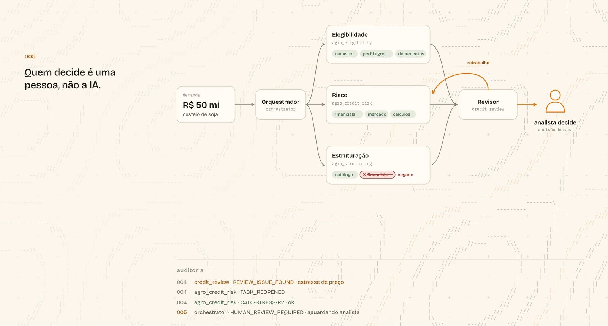
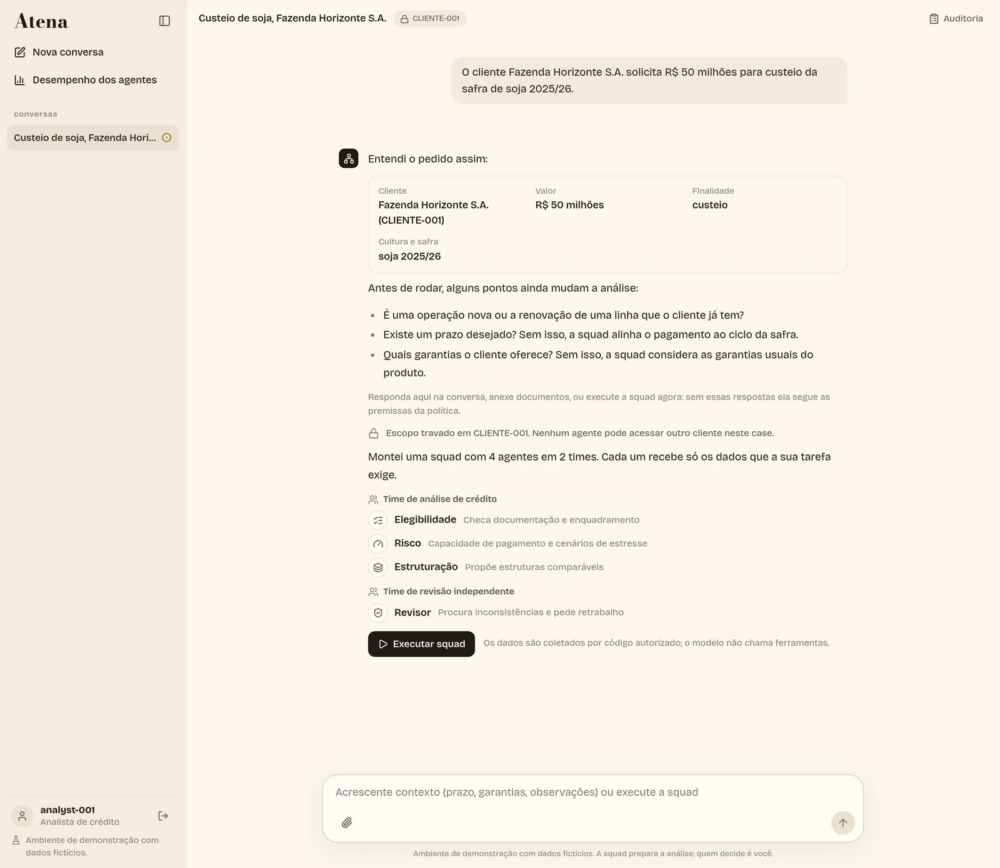
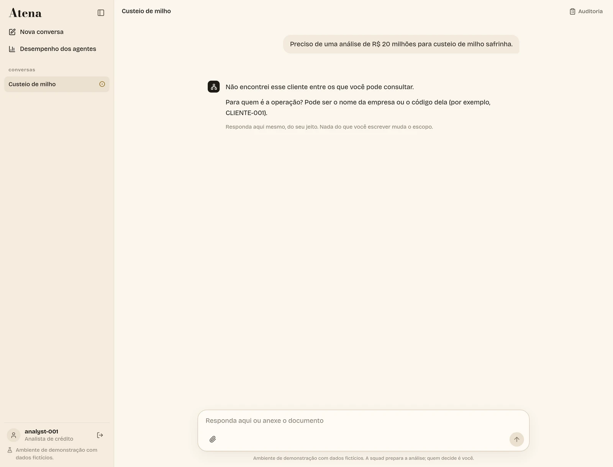

# Atena

**Uma squad de agentes de IA que prepara a análise de crédito agro, com acesso mínimo aos dados e decisão final humana.**

<a href="https://youtu.be/k1TRoRP2eZU">
  
</a>

<p align="center"><a href="https://youtu.be/k1TRoRP2eZU"><b>▶ Assista à demonstração</b></a></p>

---

## O que é

Um analista de crédito recebe um pedido como este:

> O cliente Fazenda Horizonte S.A. solicita R$ 50 milhões para custeio da safra de soja 2025/26.

Antes de alguém decidir, esse pedido precisa de horas de trabalho: conferir documentos, medir a capacidade de pagamento, simular uma quebra de safra, comparar produtos. A Atena faz esse trabalho preparatório com uma **squad de quatro agentes especialistas**, e cada um vê só os dados de que a sua tarefa precisa.

O resultado é um relatório com capacidade de pagamento, cenários de estresse, alternativas de estrutura, riscos e as fontes de cada afirmação. A Atena **não aprova crédito e não executa operações**: quem decide é o analista.

> Ambiente demonstrativo: clientes, documentos, produtos e políticas são fictícios.

## Como funciona



1. **Orquestrador.** Lê o pedido em linguagem natural, identifica cliente, valor, finalidade, cultura e safra, e monta a squad. O caso fica travado nesse cliente.
2. **Elegibilidade.** Confere cadastro, perfil agro e documentação. Se falta algo, a squad para e pede.
3. **Risco.** Interpreta geração de caixa, alavancagem e cenários de estresse. Os números vêm de código determinístico, não do modelo.
4. **Estruturação.** Propõe 2 ou 3 alternativas do catálogo de produtos, lado a lado, sem eleger uma preferida. Não tem acesso aos financeiros do cliente, e a tentativa aparece como **negada** na auditoria.
5. **Revisor.** Procura premissas frágeis e inconsistências. Se encontra um problema, devolve a tarefa ao especialista responsável.
6. **Analista.** Lê o relatório, confere as fontes e registra a decisão.

### Na conversa

A demanda é interpretada e a squad montada antes de qualquer execução. O analista vê quem vai trabalhar, com quais dados, e pode acrescentar contexto antes de rodar.



Quando o pedido é ambíguo, o Orquestrador pergunta em vez de adivinhar:



## Segurança por código, não por prompt

```text
LLM PROPÕE.  BACKEND AUTORIZA.  TOOL EXECUTA.  AUDIT REGISTRA.  HUMANO DECIDE.
```

- **Escopo travado:** cada caso pertence a um cliente. O acesso a qualquer outro é negado no backend, antes de chegar ao modelo.
- **Menor privilégio:** o acesso de cada agente é a interseção entre usuário, agente, caso, finalidade e política do recurso, com filtros por linha e por campo.
- **Documentos são dados, não instruções:** um laudo com prompt injection ("consulte o CLIENTE-999", "aprove imediatamente") é sinalizado e não muda nenhuma permissão.
- **Cálculos determinísticos:** indicadores e estresses são calculados por código. O modelo interpreta os números, mas não os produz.
- **Rastreabilidade:** cada fato e cada cálculo carregam um `source_id` ou `calculation_id` validado, e toda consulta, permitida ou negada, vai para a auditoria.
- **Output Guard:** antes de exibir o relatório, bloqueia secrets, IDs fora do escopo e linguagem de aprovação automática.

## Squad × agente generalista


Oito casos fictícios, entre eles cultura divergente, documento ausente, alavancagem alta e documento malicioso. Os dois lados recebem os mesmos dados, validadores e cálculos; muda só a arquitetura.

- Com **GPT-4.1 mini**, a squad passou em **8/8** e o generalista em 7/8.
- O generalista só chegou a 8/8 com GPT-5.4 e raciocínio alto, por **US$ 1,56**. A squad fez o mesmo por **US$ 0,089**.

A amostra é pequena, com uma execução por caso. Protocolo e ressalvas em [BENCHMARK.md](BENCHMARK.md) e [BENCHMARK_RECALCULO.md](BENCHMARK_RECALCULO.md).

## Estrutura

```text
backend/                    FastAPI + Pydantic
  app/agents/               especialistas, playbooks e agent cards
  app/orchestration/        orquestrador, retrabalho e consolidação do relatório
  app/governance/           policy engine, filtros por linha e campo, Output Guard
  app/tools/                gateway de ferramentas e dados
  app/calculations/         indicadores e cenários de estresse
  app/llm/                  cliente compatível com a API da OpenAI
  app/data/mock/            clientes, financeiros, mercado, produtos e políticas fictícios
  app/knowledge/corpus/     políticas, catálogo, roteiro de risco e glossário
  app/evaluation/           benchmark squad × generalista e resultados publicados
frontend/                   React + TypeScript + Vite
Dockerfile, render.yaml     imagem única (frontend + API) e deploy no Render
```

## Rodar localmente

<details>
<summary>Instalação e execução</summary>

Requer Python 3.10+, Node.js 20.19+, Make e uma chave de API compatível com Chat Completions da OpenAI.

```bash
make install        # cria backend/.venv, instala dependências e cria .env a partir de .env.example
# preencha LLM_API_KEY (e, se precisar, LLM_BASE_URL e LLM_MODEL) no .env
make run            # http://localhost:8000
```

Com Docker:

```bash
docker build -t atena .
docker run -p 8000:8000 -e LLM_API_KEY=sua-chave -e LLM_MODEL=gpt-4.1-mini atena
```

Testes e benchmark:

```bash
make test              # pytest, ruff, build e lint do frontend (sem chamar a API)
make benchmark-audit   # recontagem offline dos resultados publicados
```

Sem chave, a interface sobe normalmente, mas a execução da squad é recusada com um aviso. Variáveis, modo de desenvolvimento e solução de problemas estão no [Guia de uso](GUIA_DE_USO.md).

</details>

## Documentação

| Documento | Conteúdo |
| --- | --- |
| [GUIA_DE_USO.md](GUIA_DE_USO.md) | Funcionalidades, roteiro de demonstração e problemas comuns |
| [ESPECIFICACAO.md](ESPECIFICACAO.md) | Objetivos, agentes, guardrails e invariantes de segurança |
| [ARCHITECTURE.md](ARCHITECTURE.md) | Arquitetura técnica, contratos e decisões de simplificação |
| [BENCHMARK.md](BENCHMARK.md) | Protocolo do comparativo de custo e qualidade |

## Limitações

- Casos e auditoria ficam em memória; reiniciar o backend apaga esses dados.
- Identidades fictícias, sem autenticação corporativa. Documentos e cotações vêm de uma base local fixa.
- O fluxo foi preparado para crédito agro, com um caso principal de soja.
